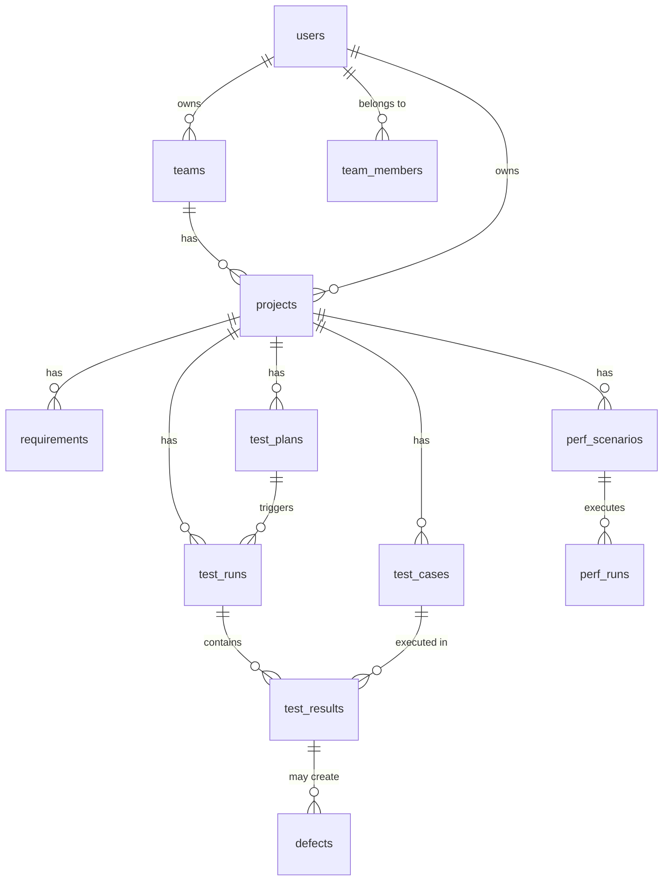

# 自动化测试平台 · 数据库设计与ER图

> 版本：v2.0 | 日期：2026-06-17 | 数据库策略：MySQL 8.0（业务库）+ PostgreSQL 14（分析库）

---

## 一、数据库分工总览

```
┌─────────────────────────────────────────────────────────────┐
│                    MySQL 8.0 业务库                          │
│  （事务型，高并发CRUD，ACID保证）                           │
│  数据库名：testops_core                                      │
├─────────────────────────────────────────────────────────────┤
│  用户/权限模块         项目/团队模块                         │
│  测试用例管理            测试执行管理                         │
│  测试报告元数据          系统配置/审计日志                    │
└─────────────────────────────────────────────────────────────┘
                           ↓ CDC同步（Debezium）
┌─────────────────────────────────────────────────────────────┐
│                  PostgreSQL 14 分析库                         │
│  （分析型，复杂查询，JSONB，时序数据）                       │
│  数据库名：testops_analytics                                 │
├─────────────────────────────────────────────────────────────┤
│  执行结果明细（超宽表）    趋势分析数据                       │
│  性能指标时序数据           缺陷聚合数据                       │
│  AI分析记录               自定义报表数据                       │
└─────────────────────────────────────────────────────────────┘
```

---

## 二、MySQL业务库表结构设计

### 2.1 用户与权限模块

```sql
-- 用户表
CREATE TABLE `users` (
  `id` BIGINT UNSIGNED NOT NULL AUTO_INCREMENT,
  `username` VARCHAR(64) NOT NULL COMMENT '登录用户名，唯一',
  `email` VARCHAR(255) NOT NULL COMMENT '邮箱，唯一',
  `password_hash` VARCHAR(255) NOT NULL COMMENT 'bcrypt加密',
  `display_name` VARCHAR(64) NOT NULL COMMENT '显示名称',
  `avatar_url` VARCHAR(500) DEFAULT NULL,
  `role` ENUM('admin','pm','tester','viewer') NOT NULL DEFAULT 'tester',
  `status` ENUM('active','disabled','pending') NOT NULL DEFAULT 'active',
  `last_login_at` DATETIME DEFAULT NULL,
  `created_at` DATETIME NOT NULL DEFAULT CURRENT_TIMESTAMP,
  `updated_at` DATETIME NOT NULL DEFAULT CURRENT_TIMESTAMP ON UPDATE CURRENT_TIMESTAMP,
  PRIMARY KEY (`id`),
  UNIQUE KEY `uk_username` (`username`),
  UNIQUE KEY `uk_email` (`email`)
) ENGINE=InnoDB DEFAULT CHARSET=utf8mb4 COMMENT='用户表';

-- 团队表
CREATE TABLE `teams` (
  `id` BIGINT UNSIGNED NOT NULL AUTO_INCREMENT,
  `name` VARCHAR(128) NOT NULL COMMENT '团队名称',
  `description` VARCHAR(500) DEFAULT NULL,
  `owner_id` BIGINT UNSIGNED NOT NULL COMMENT '团队所有者',
  `created_at` DATETIME NOT NULL DEFAULT CURRENT_TIMESTAMP,
  `updated_at` DATETIME NOT NULL DEFAULT CURRENT_TIMESTAMP ON UPDATE CURRENT_TIMESTAMP,
  PRIMARY KEY (`id`),
  KEY `idx_owner` (`owner_id`),
  CONSTRAINT `fk_teams_owner` FOREIGN KEY (`owner_id`) REFERENCES `users`(`id`)
) ENGINE=InnoDB DEFAULT CHARSET=utf8mb4 COMMENT='团队表';

-- 团队成员表（多对多）
CREATE TABLE `team_members` (
  `id` BIGINT UNSIGNED NOT NULL AUTO_INCREMENT,
  `team_id` BIGINT UNSIGNED NOT NULL,
  `user_id` BIGINT UNSIGNED NOT NULL,
  `role` ENUM('owner','admin','member','guest') NOT NULL DEFAULT 'member',
  `joined_at` DATETIME NOT NULL DEFAULT CURRENT_TIMESTAMP,
  PRIMARY KEY (`id`),
  UNIQUE KEY `uk_team_user` (`team_id`,`user_id`),
  CONSTRAINT `fk_tm_team` FOREIGN KEY (`team_id`) REFERENCES `teams`(`id`) ON DELETE CASCADE,
  CONSTRAINT `fk_tm_user` FOREIGN KEY (`user_id`) REFERENCES `users`(`id`) ON DELETE CASCADE
) ENGINE=InnoDB DEFAULT CHARSET=utf8mb4 COMMENT='团队成员关系表';
```

### 2.2 项目与需求模块

```sql
-- 项目表
CREATE TABLE `projects` (
  `id` BIGINT UNSIGNED NOT NULL AUTO_INCREMENT,
  `team_id` BIGINT UNSIGNED NOT NULL,
  `name` VARCHAR(128) NOT NULL COMMENT '项目名称',
  `description` TEXT DEFAULT NULL,
  `status` ENUM('planning','active','archived') NOT NULL DEFAULT 'active',
  `owner_id` BIGINT UNSIGNED NOT NULL COMMENT '项目负责人',
  `config_json` JSON DEFAULT NULL COMMENT '项目配置（环境/变量/集成）',
  `created_at` DATETIME NOT NULL DEFAULT CURRENT_TIMESTAMP,
  `updated_at` DATETIME NOT NULL DEFAULT CURRENT_TIMESTAMP ON UPDATE CURRENT_TIMESTAMP,
  PRIMARY KEY (`id`),
  KEY `idx_team` (`team_id`),
  KEY `idx_owner` (`owner_id`)
) ENGINE=InnoDB DEFAULT CHARSET=utf8mb4 COMMENT='项目表';

-- 需求/用户故事表
CREATE TABLE `requirements` (
  `id` BIGINT UNSIGNED NOT NULL AUTO_INCREMENT,
  `project_id` BIGINT UNSIGNED NOT NULL,
  `title` VARCHAR(255) NOT NULL COMMENT '需求标题',
  `description` TEXT DEFAULT NULL COMMENT '需求描述',
  `source_type` ENUM('manual','ai_parsed','jira','tapd') DEFAULT 'manual',
  `source_id` VARCHAR(128) DEFAULT NULL COMMENT '外部系统ID',
  `status` ENUM('draft','reviewing','approved','covered','done') DEFAULT 'draft',
  `priority` ENUM('low','medium','high','critical') DEFAULT 'medium',
  `created_by` BIGINT UNSIGNED NOT NULL,
  `created_at` DATETIME NOT NULL DEFAULT CURRENT_TIMESTAMP,
  `updated_at` DATETIME NOT NULL DEFAULT CURRENT_TIMESTAMP ON UPDATE CURRENT_TIMESTAMP,
  PRIMARY KEY (`id`),
  KEY `idx_project` (`project_id`),
  KEY `idx_status` (`status`)
) ENGINE=InnoDB DEFAULT CHARSET=utf8mb4 COMMENT='需求表';
```

### 2.3 测试用例模块

```sql
-- 测试用例表（核心表，支持多类型）
CREATE TABLE `test_cases` (
  `id` BIGINT UNSIGNED NOT NULL AUTO_INCREMENT,
  `project_id` BIGINT UNSIGNED NOT NULL,
  `title` VARCHAR(255) NOT NULL COMMENT '用例标题',
  `case_type` ENUM('api','ui_web','ui_mobile','performance','integration') NOT NULL,
  `priority` ENUM('p0','p1','p2','p3') NOT NULL DEFAULT 'p1',
  `status` ENUM('draft','ready','deprecated') NOT NULL DEFAULT 'draft',
  `description` TEXT DEFAULT NULL COMMENT '用例描述/前置条件',
  `steps_json` JSON NOT NULL COMMENT '测试步骤（结构化JSON）',
  `assertions_json` JSON NOT NULL COMMENT '断言列表',
  `tags_json` JSON DEFAULT NULL COMMENT '标签数组',
  `folder_id` BIGINT UNSIGNED DEFAULT NULL COMMENT '所属目录',
  `created_by` BIGINT UNSIGNED NOT NULL,
  `ai_generated` TINYINT(1) NOT NULL DEFAULT 0 COMMENT '是否AI生成',
  `ai_confidence` DECIMAL(3,2) DEFAULT NULL COMMENT 'AI生成置信度0-1',
  `version` INT NOT NULL DEFAULT 1,
  `created_at` DATETIME NOT NULL DEFAULT CURRENT_TIMESTAMP,
  `updated_at` DATETIME NOT NULL DEFAULT CURRENT_TIMESTAMP ON UPDATE CURRENT_TIMESTAMP,
  PRIMARY KEY (`id`),
  KEY `idx_project_type` (`project_id`,`case_type`),
  KEY `idx_status` (`status`),
  KEY `idx_created_by` (`created_by`)
) ENGINE=InnoDB DEFAULT CHARSET=utf8mb4 COMMENT='测试用例表';

-- 用例目录树表
CREATE TABLE `case_folders` (
  `id` BIGINT UNSIGNED NOT NULL AUTO_INCREMENT,
  `project_id` BIGINT UNSIGNED NOT NULL,
  `name` VARCHAR(128) NOT NULL,
  `parent_id` BIGINT UNSIGNED DEFAULT NULL,
  `sort_order` INT NOT NULL DEFAULT 0,
  `created_at` DATETIME NOT NULL DEFAULT CURRENT_TIMESTAMP,
  PRIMARY KEY (`id`),
  KEY `idx_project` (`project_id`)
) ENGINE=InnoDB DEFAULT CHARSET=utf8mb4 COMMENT='用例目录表';

-- API测试专用：接口定义表
CREATE TABLE `api_endpoints` (
  `id` BIGINT UNSIGNED NOT NULL AUTO_INCREMENT,
  `project_id` BIGINT UNSIGNED NOT NULL,
  `name` VARCHAR(255) NOT NULL COMMENT '接口名称',
  `method` ENUM('GET','POST','PUT','DELETE','PATCH','HEAD','OPTIONS') NOT NULL,
  `url` VARCHAR(2000) NOT NULL COMMENT '接口URL（支持变量）',
  `headers_json` JSON DEFAULT NULL,
  `auth_config_json` JSON DEFAULT NULL COMMENT '认证配置',
  `created_by` BIGINT UNSIGNED NOT NULL,
  `created_at` DATETIME NOT NULL DEFAULT CURRENT_TIMESTAMP,
  PRIMARY KEY (`id`),
  KEY `idx_project` (`project_id`)
) ENGINE=InnoDB DEFAULT CHARSET=utf8mb4 COMMENT='API接口定义表';
```

### 2.4 测试执行模块

```sql
-- 测试计划表
CREATE TABLE `test_plans` (
  `id` BIGINT UNSIGNED NOT NULL AUTO_INCREMENT,
  `project_id` BIGINT UNSIGNED NOT NULL,
  `name` VARCHAR(255) NOT NULL,
  `description` TEXT DEFAULT NULL,
  `case_ids_json` JSON NOT NULL COMMENT '关联的用例ID数组',
  `env_config_json` JSON DEFAULT NULL COMMENT '环境配置',
  `schedule_type` ENUM('manual','cron','webhook') DEFAULT 'manual',
  `schedule_config_json` JSON DEFAULT NULL,
  `status` ENUM('draft','active','archived') DEFAULT 'draft',
  `created_by` BIGINT UNSIGNED NOT NULL,
  `created_at` DATETIME NOT NULL DEFAULT CURRENT_TIMESTAMP,
  PRIMARY KEY (`id`),
  KEY `idx_project` (`project_id`)
) ENGINE=InnoDB DEFAULT CHARSET=utf8mb4 COMMENT='测试计划表';

-- 测试执行记录表（一次执行 = 一行）
CREATE TABLE `test_runs` (
  `id` BIGINT UNSIGNED NOT NULL AUTO_INCREMENT,
  `project_id` BIGINT UNSIGNED NOT NULL,
  `plan_id` BIGINT UNSIGNED DEFAULT NULL,
  `name` VARCHAR(255) NOT NULL COMMENT '执行名称',
  `run_type` ENUM('manual','schedule','ci_cd','api') NOT NULL DEFAULT 'manual',
  `trigger_source` VARCHAR(128) DEFAULT NULL COMMENT '触发来源（Git Hash/流水线ID）',
  `status` ENUM('queued','running','passed','failed','canceled','error') NOT NULL DEFAULT 'queued',
  `triggered_by` BIGINT UNSIGNED DEFAULT NULL,
  `started_at` DATETIME DEFAULT NULL,
  `finished_at` DATETIME DEFAULT NULL,
  `duration_ms` BIGINT DEFAULT NULL,
  `total_cases` INT NOT NULL DEFAULT 0,
  `passed_count` INT NOT NULL DEFAULT 0,
  `failed_count` INT NOT NULL DEFAULT 0,
  `skipped_count` INT NOT NULL DEFAULT 0,
  `report_url` VARCHAR(500) DEFAULT NULL,
  `created_at` DATETIME NOT NULL DEFAULT CURRENT_TIMESTAMP,
  PRIMARY KEY (`id`),
  KEY `idx_project` (`project_id`),
  KEY `idx_status` (`status`),
  KEY `idx_created_at` (`created_at`)
) ENGINE=InnoDB DEFAULT CHARSET=utf8mb4 COMMENT='测试执行记录表';

-- 用例执行结果表（一条用例在一个Run里的执行结果）
CREATE TABLE `test_results` (
  `id` BIGINT UNSIGNED NOT NULL AUTO_INCREMENT,
  `run_id` BIGINT UNSIGNED NOT NULL,
  `case_id` BIGINT UNSIGNED NOT NULL,
  `status` ENUM('passed','failed','skipped','error','running') NOT NULL,
  `duration_ms` INT DEFAULT NULL,
  `error_message` TEXT DEFAULT NULL,
  `stack_trace` TEXT DEFAULT NULL,
  `screenshot_url` VARCHAR(500) DEFAULT NULL,
  `request_log_json` JSON DEFAULT NULL COMMENT 'API请求/响应日志',
  `ai_analysis_json` JSON DEFAULT NULL COMMENT 'AI失败根因分析',
  `created_at` DATETIME NOT NULL DEFAULT CURRENT_TIMESTAMP,
  PRIMARY KEY (`id`),
  KEY `idx_run` (`run_id`),
  KEY `idx_case` (`case_id`),
  CONSTRAINT `fk_results_run` FOREIGN KEY (`run_id`) REFERENCES `test_runs`(`id`) ON DELETE CASCADE
) ENGINE=InnoDB DEFAULT CHARSET=utf8mb4 COMMENT='测试用例执行结果表';
```

### 2.5 性能压测专用表

```sql
-- 性能测试场景表
CREATE TABLE `perf_scenarios` (
  `id` BIGINT UNSIGNED NOT NULL AUTO_INCREMENT,
  `project_id` BIGINT UNSIGNED NOT NULL,
  `name` VARCHAR(255) NOT NULL COMMENT '场景名称',
  `description` TEXT DEFAULT NULL,
  `test_type` ENUM('single_interface','multi_interface','link_tracing','stability') NOT NULL,
  `config_json` JSON NOT NULL COMMENT '压测配置（并发数/持续时间/ ramp-up）',
  `target_endpoints_json` JSON NOT NULL COMMENT '目标接口列表',
  `status` ENUM('draft','ready','archived') DEFAULT 'draft',
  `created_by` BIGINT UNSIGNED NOT NULL,
  `created_at` DATETIME NOT NULL DEFAULT CURRENT_TIMESTAMP,
  PRIMARY KEY (`id`),
  KEY `idx_project` (`project_id`)
) ENGINE=InnoDB DEFAULT CHARSET=utf8mb4 COMMENT='性能测试场景表';

-- 性能测试执行记录表
CREATE TABLE `perf_runs` (
  `id` BIGINT UNSIGNED NOT NULL AUTO_INCREMENT,
  `scenario_id` BIGINT UNSIGNED NOT NULL,
  `project_id` BIGINT UNSIGNED NOT NULL,
  `status` ENUM('queued','running','passed','failed','canceled') NOT NULL DEFAULT 'queued',
  `started_at` DATETIME DEFAULT NULL,
  `finished_at` DATETIME DEFAULT NULL,
  `duration_seconds` INT DEFAULT NULL,
  `config_snapshot_json` JSON NOT NULL COMMENT '执行时的配置快照',
  `triggered_by` BIGINT UNSIGNED DEFAULT NULL,
  `report_url` VARCHAR(500) DEFAULT NULL,
  `created_at` DATETIME NOT NULL DEFAULT CURRENT_TIMESTAMP,
  PRIMARY KEY (`id`),
  KEY `idx_scenario` (`scenario_id`)
) ENGINE=InnoDB DEFAULT CHARSET=utf8mb4 COMMENT='性能测试执行记录表';
```

### 2.6 报告与缺陷模块

```sql
-- 缺陷记录表
CREATE TABLE `defects` (
  `id` BIGINT UNSIGNED NOT NULL AUTO_INCREMENT,
  `project_id` BIGINT UNSIGNED NOT NULL,
  `title` VARCHAR(255) NOT NULL,
  `description` TEXT DEFAULT NULL,
  `severity` ENUM('critical','high','medium','low') NOT NULL DEFAULT 'medium',
  `status` ENUM('open','in_progress','resolved','closed','wont_fix') DEFAULT 'open',
  `related_run_id` BIGINT UNSIGNED DEFAULT NULL COMMENT '关联的测试执行',
  `related_case_id` BIGINT UNSIGNED DEFAULT NULL,
  `assigned_to` BIGINT UNSIGNED DEFAULT NULL,
  `external_id` VARCHAR(128) DEFAULT NULL COMMENT 'Jira/TAPD缺陷ID',
  `created_by` BIGINT UNSIGNED NOT NULL,
  `created_at` DATETIME NOT NULL DEFAULT CURRENT_TIMESTAMP,
  `updated_at` DATETIME NOT NULL DEFAULT CURRENT_TIMESTAMP ON UPDATE CURRENT_TIMESTAMP,
  PRIMARY KEY (`id`),
  KEY `idx_project` (`project_id`),
  KEY `idx_status` (`status`)
) ENGINE=InnoDB DEFAULT CHARSET=utf8mb4 COMMENT='缺陷记录表';
```

---

## 三、PostgreSQL分析库表结构设计

```sql
-- 执行结果明细宽表（面向分析查询优化）
CREATE TABLE analytics.test_results_detail (
  id BIGSERIAL PRIMARY KEY,
  run_id BIGINT NOT NULL,
  case_id BIGINT NOT NULL,
  project_id BIGINT NOT NULL,
  case_type VARCHAR(32) NOT NULL,
  status VARCHAR(32) NOT NULL,
  duration_ms INT,
  executed_at TIMESTAMPTZ NOT NULL DEFAULT NOW(),
  env_name VARCHAR(64),
  -- 时序数据字段（用于趋势分析）
  moving_avg_7d FLOAT,  -- 7日移动平均通过率
  flakiness_score FLOAT, -- 用例抖动分数
  -- JSONB存储灵活字段
  tags JSONB DEFAULT '[]',
  metadata JSONB DEFAULT '{}'
);
CREATE INDEX idx_results_detail_project ON analytics.test_results_detail(project_id, executed_at);
CREATE INDEX idx_results_detail_tags ON analytics.test_results_detail USING GIN(tags);

-- 性能指标时序数据表（TimescaleDB超表）
CREATE TABLE analytics.perf_metrics (
  time TIMESTAMPTZ NOT NULL,
  perf_run_id BIGINT NOT NULL,
  scenario_id BIGINT NOT NULL,
  metric_name VARCHAR(64) NOT NULL,  -- qps/rt/error_rate/cpu/memory
  metric_value FLOAT NOT NULL,
  labels_json JSONB DEFAULT '{}',    -- 额外标签
  PRIMARY KEY (time, perf_run_id)
);
-- SELECT create_hypertable('analytics.perf_metrics', 'time');  -- TimescaleDB

-- AI分析历史表
CREATE TABLE analytics.ai_analysis_log (
  id BIGSERIAL PRIMARY KEY,
  run_id BIGINT,
  result_id BIGINT,
  analysis_type VARCHAR(64) NOT NULL,  -- failure_root_cause / case_suggestion / risk_prediction
  input_text TEXT,
  output_json JSONB NOT NULL,
  model_name VARCHAR(64),
  confidence_score FLOAT,
  created_at TIMESTAMPTZ NOT NULL DEFAULT NOW()
);
```

---

## 四、ER图（Mermaid）



---

## 五、索引与性能优化策略

| 表 | 关键索引 | 原因 |
|----|---------|------|
| test_results | (run_id, status) 复合索引 | 按执行查失败用例是最高频查询 |
| test_cases | (project_id, case_type, status) | 用例列表筛选 |
| test_runs | (project_id, created_at DESC) | 执行历史时间倒序 |
| perf_metrics | TimescaleDB时间分区 | 时序数据自动分区 |

---

## 六、数据同步策略

```
MySQL testops_core
    ↓ Debezium CDC（Kafka Connect）
    ↓（近实时，延迟 < 2s）
PostgreSQL testops_analytics
    ↓ 定时聚合（pg_cron，每15分钟）
analytics.test_results_detail（分析宽表）
```
